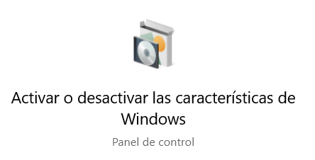
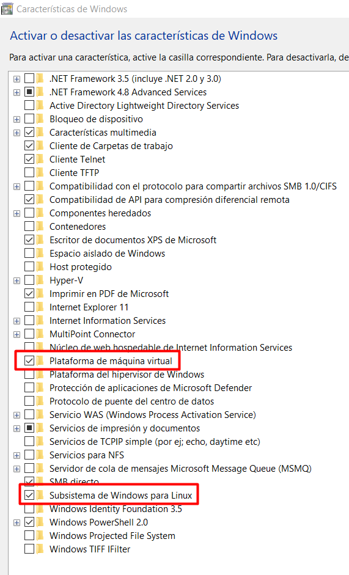
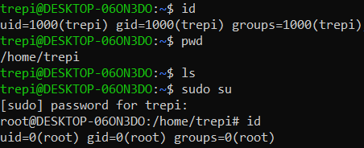

# HOW TO INSTALL WSL for Windows 10 (also works on W11)

## 1 STEP
```
On the Windows 10 search bar search for 'Microsoft Store' and open it.
```

## 2 STEP
```
Search for "Windows Subsystem for Linux" and click on "Install"
```

## 3 STEP
```
On the Windows 10 search bar search for 'Windows Features' and open it.
```

## 4 STEP
```
Enable 2 features:
- Windows Subsystem for Linux
- Virtual Machine Platform
```

## 5 STEP
```
Click on install, wait and restart the PC
```

## 6 STEP
```
Open the Windows Terminal (cmd) and check if WSL is installed correctly by executing:
wsl -v
```

## 7 STEP
```
Check for all possible installations by executing:
wsl --list --online
```

## 8 STEP
```
Install your favorite OS by executing:
wsl --install -d {OS}
```

## 9 STEP
```
On the Windows 10 search bar search for 'WSL' and open it.
```

## 10 STEP
```
Check if all it's OK
```



# ERR 1
```
Sometimes with the basic user you don't have enough permissions to execute the 'ping' command.
You may execute:
sudo setcap cap_net_raw+ep /bin/ping
```
